# PQSE diagrams

Mermaid diagrams of the PQSE secure element (v4, `hw/se`). GitHub renders them in place; elsewhere, paste a block into [mermaid.live](https://mermaid.live). Names in `code` are RTL modules, instances, microcode labels or Makefile targets. The text explanations are in [`PQSE_design.md`](PQSE_design.md) and [`hw/se/README.md`](../hw/se/README.md).

1. [System overview](#1-system-overview)
2. [Module hierarchy](#2-module-hierarchy)
3. [Share domains and memories](#3-share-domains-and-memories)
4. [Masked AND gadget (DOM)](#4-masked-and-gadget-dom)
5. [Sequencer state machine](#5-sequencer-state-machine)
6. [Lifecycle and security state](#6-lifecycle-and-security-state)
7. [A command and the fault response](#7-a-command-and-the-fault-response)
8. [KeyGen with its fault checks](#8-keygen-with-its-fault-checks)
9. [Masked Decaps](#9-masked-decaps)
10. [PUF key and key wrapping](#10-puf-key-and-key-wrapping)
11. [Secure messaging](#11-secure-messaging)
12. [Verification and energy flow](#12-verification-and-energy-flow)

## 1. System overview

The host talks to a 32-bit register bus through SPI (chip) or Avalon-MM (FPGA). `pqse_host` owns the lifecycle, the access rules and the fault response; `pqse_core` runs one engine at a time under microcode.

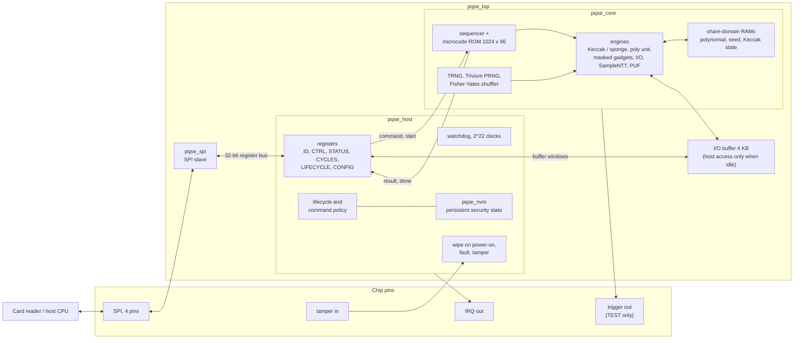

## 2. Module hierarchy

Instance names as in the RTL. `pqse_avalon` replaces `pqse_top` on the FPGA; both wrap `pqse_sys`.

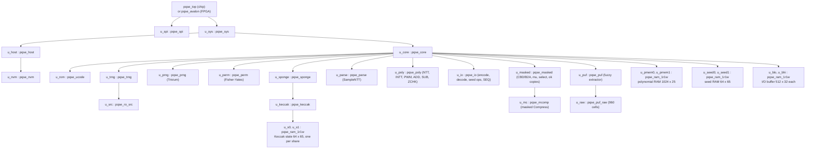

## 3. Share domains and memories

Every secret is two shares. Share 0 and share 1 never sit in the same RAM, bus or read register; they meet only inside registered DOM gadgets, which produce either new shares or a value that is public by design.

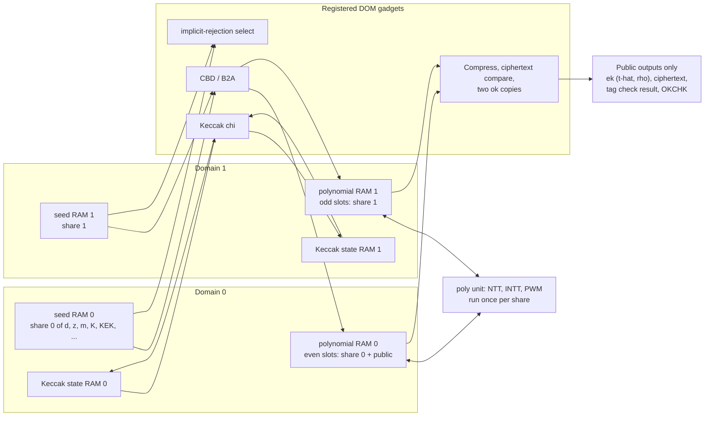

## 4. Masked AND gadget (DOM)

The building block of every nonlinear masked step (Keccak chi, the Compress adder, the ok accumulators, the select). With z = x AND y and x = x0 XOR x1, y = y0 XOR y1, the two cross terms are refreshed with a fresh random bit r and every partial product is registered before the shares are combined.

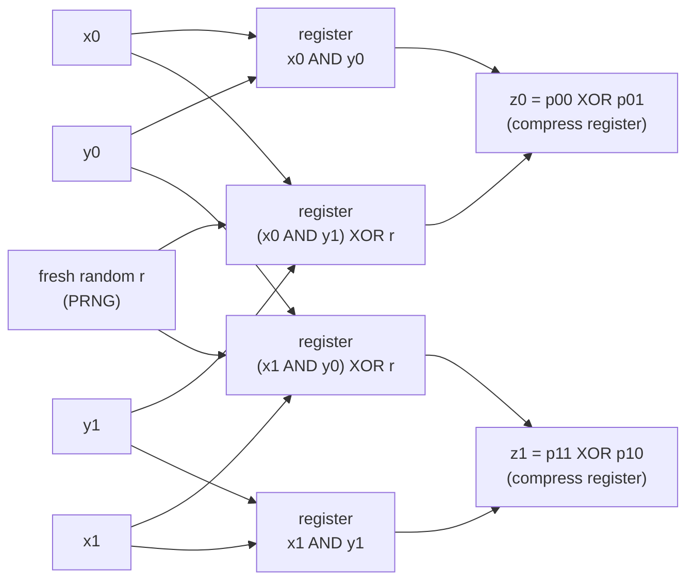

## 5. Sequencer state machine

`pqse_core`, register `q` with its complemented shadow `q_n`. A shadow mismatch, a pc shadow mismatch, an instruction parity error or an engine that never reported busy raises a fault from any state.

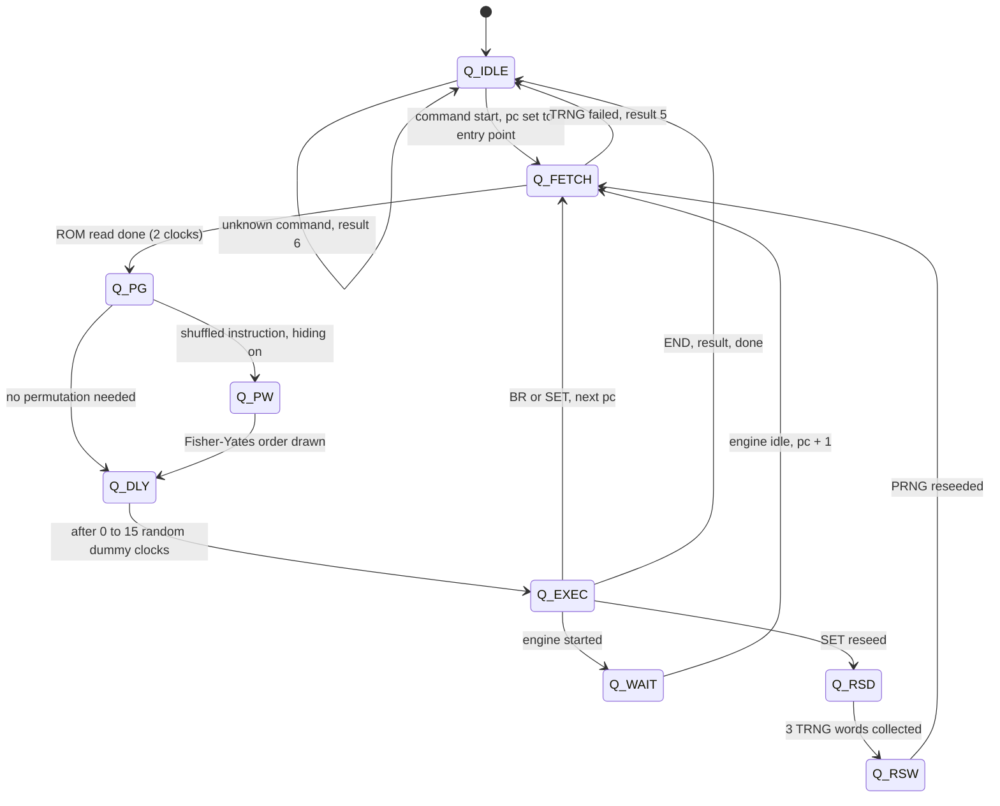

## 6. Lifecycle and security state

The lifecycle only moves forward. The fault counter, the tamper flag and the lifecycle each have a complemented shadow and live in the persistent store `pqse_nvm`, written before the next command is accepted.

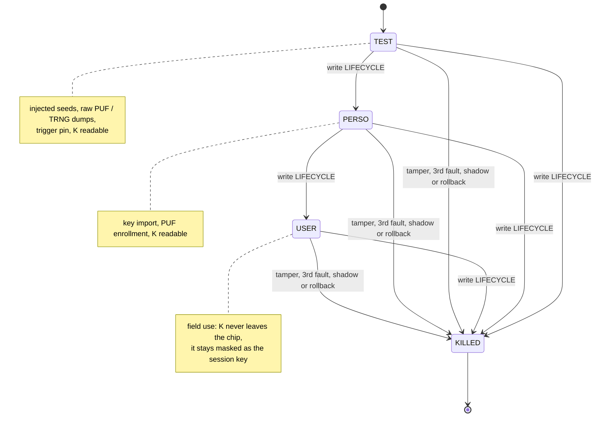

## 7. A command and the fault response

Any detector ends the command with result 8 (FAULT). The host wipes every key and counts the fault before it accepts the next command.

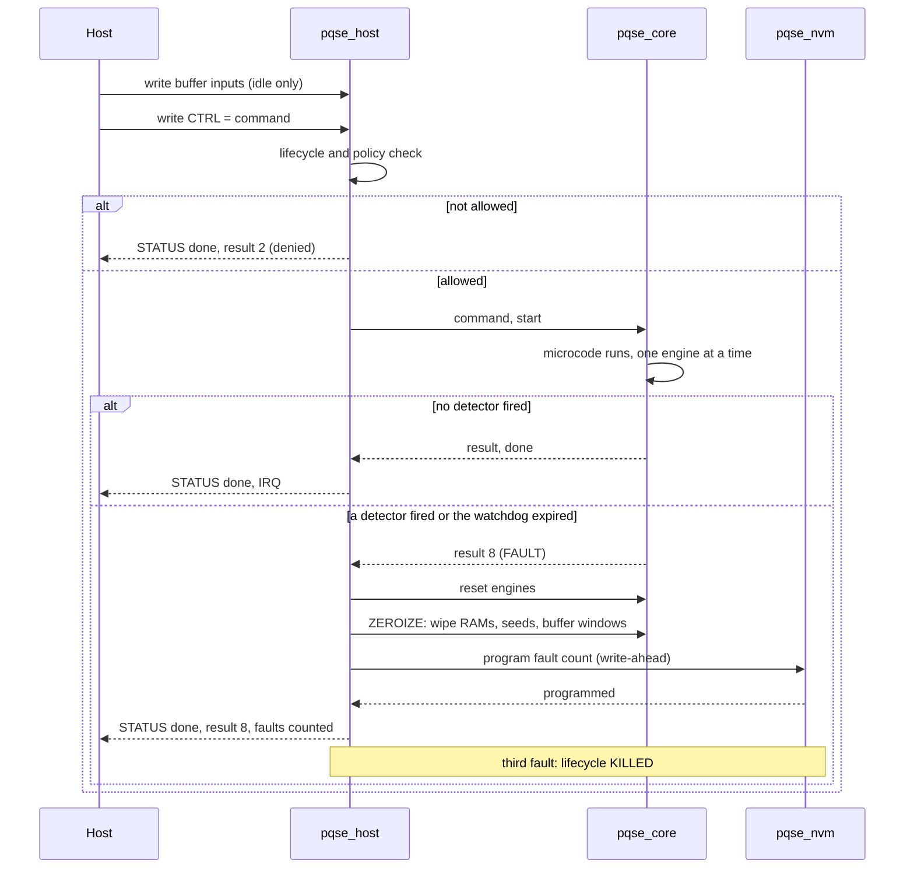

## 8. KeyGen with its fault checks

Microcode at 16 (seeds), 80 (G), 720 (s and e twice, then the G check at 790), 106 (t-hat), 608 (pairwise test), 144 (wrap, KGWRAP only), 156 (wipe). Everything is masked until t-hat is complete; t-hat and rho are public.

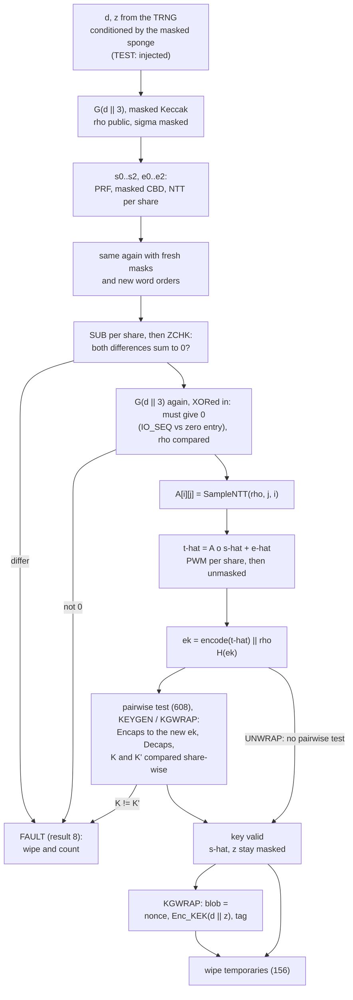

## 9. Masked Decaps

Microcode at 320. m', K', r', the comparison result and K never exist unmasked. A fault that forces "c' = c" or disturbs one decoding of m' is caught by the two ok copies (OKCHK) and the double decoding (IO_SEQ).

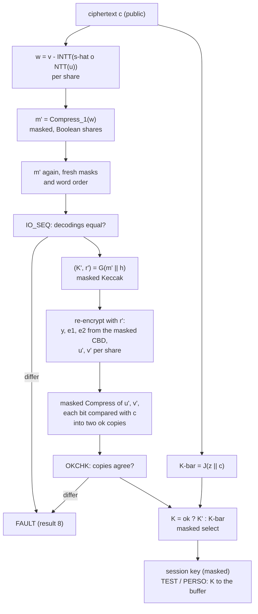

## 10. PUF key and key wrapping

The secret key is never stored. The PUF gives a 180-bit key k through an RM(1,5) fuzzy extractor; the key-encryption key KEK = SHA3-256(k ‖ "K") wraps the seed d || z.

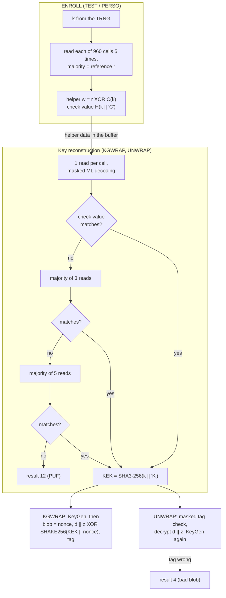

## 11. Secure messaging

The ML-KEM shared secret stays inside as the masked session key SK. SEAL and OPEN use KMAC256 with direction-specific customization, so a message reflected to its sender fails.

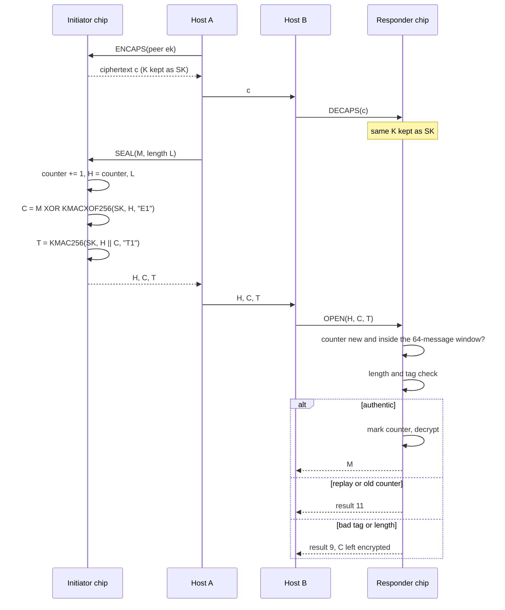

## 12. Verification and energy flow

The `make` targets and what feeds the reported numbers.

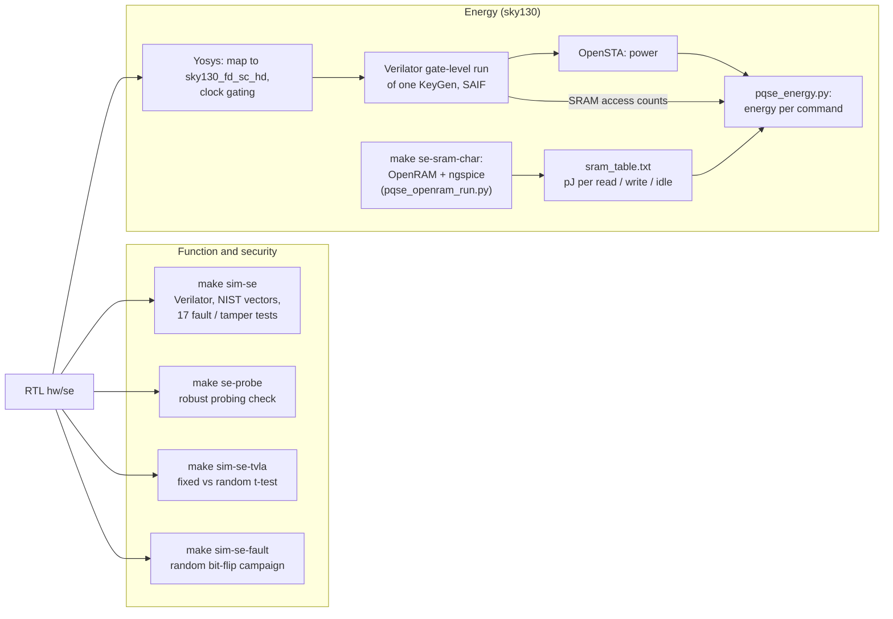
