# PQSE diagrams

Diagrams of the PQSE secure element (v4, `hw/se`) in Mermaid. GitHub draws them in place; elsewhere, paste a block into [mermaid.live](https://mermaid.live). Names in `code` are RTL modules, instances, microcode labels or Makefile targets. The design is explained in [`PQSE_design.md`](PQSE_design.md), the RTL in [`hw/se/README.md`](../hw/se/README.md).

Conventions: solid arrows carry data or control, dotted arrows go to a fault or error exit, thick borders mark checks.

1. [System overview](#1-system-overview)
2. [Module hierarchy](#2-module-hierarchy)
3. [Share domains](#3-share-domains)
4. [Masked AND gate (DOM)](#4-masked-and-gate-dom)
5. [Sequencer](#5-sequencer)
6. [Lifecycle](#6-lifecycle)
7. [Command and fault response](#7-command-and-fault-response)
8. [KeyGen](#8-keygen)
9. [Decaps](#9-decaps)
10. [PUF key and key wrapping](#10-puf-key-and-key-wrapping)
11. [Secure messaging](#11-secure-messaging)
12. [Verification and energy flow](#12-verification-and-energy-flow)

## 1. System overview

Three layers: the pins, the host interface `pqse_host`, and the core `pqse_core`, which runs one engine at a time.

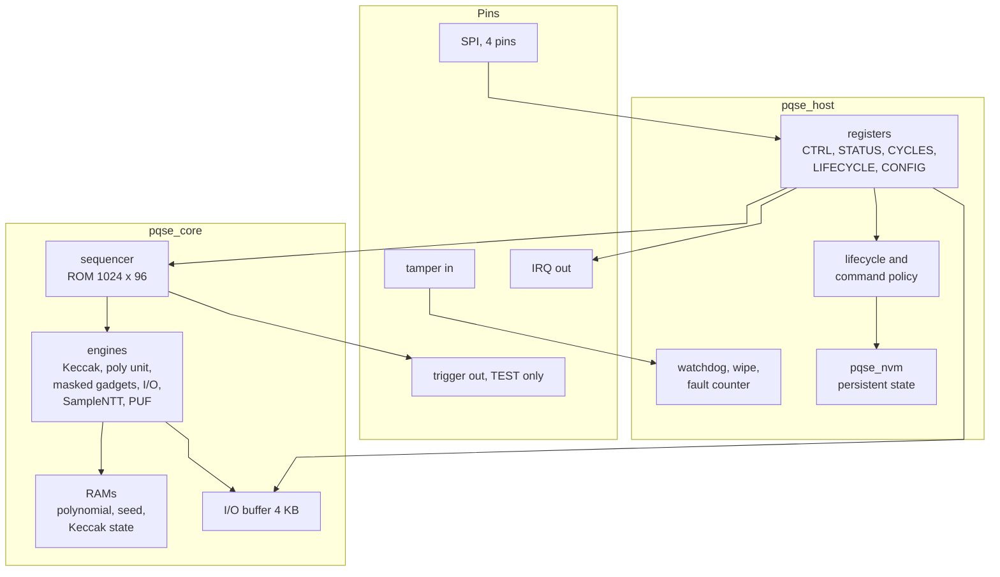

## 2. Module hierarchy

Instance names from the RTL. On the FPGA, `pqse_avalon` takes the place of `pqse_top`; both contain `pqse_sys`.

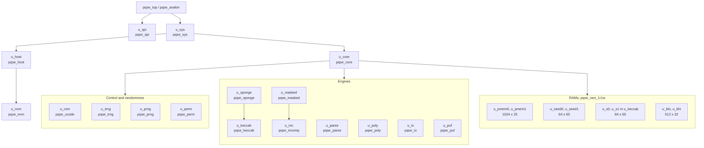

## 3. Share domains

A secret exists as share 0 and share 1. The shares are stored in separate RAMs and meet only inside the registered gadgets in the middle column.

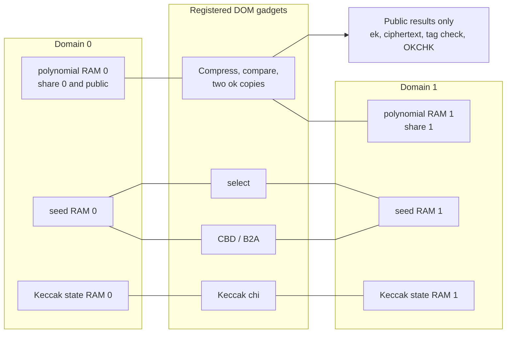

The poly unit (NTT, INTT, PWM) is linear, so it runs once on share 0 and once on share 1 and needs no gadget.

## 4. Masked AND gate (DOM)

z = x AND y with x = x0 XOR x1 and y = y0 XOR y1. The cross terms get a fresh random bit r, and every partial product is registered before the shares are recombined. Keccak chi, the Compress adder, the ok copies and the select all use this gate.

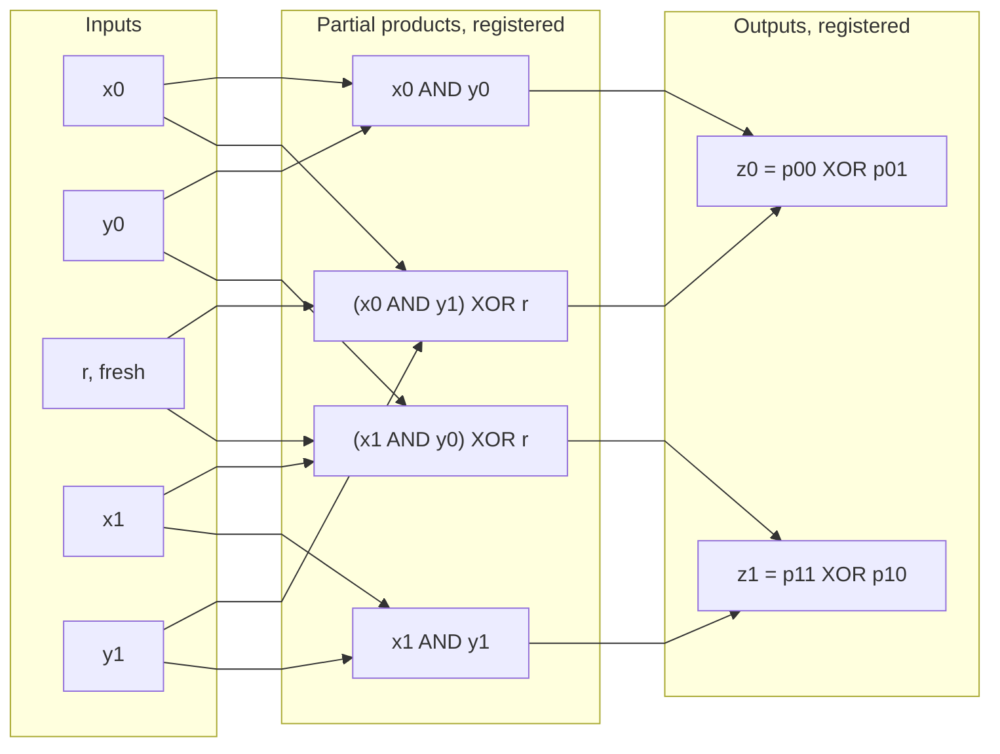

## 5. Sequencer

The `q` register in `pqse_core`. It has a complemented copy `q_n`; a mismatch, a pc-shadow mismatch, an instruction parity error or an engine that never started raises a fault in any state.

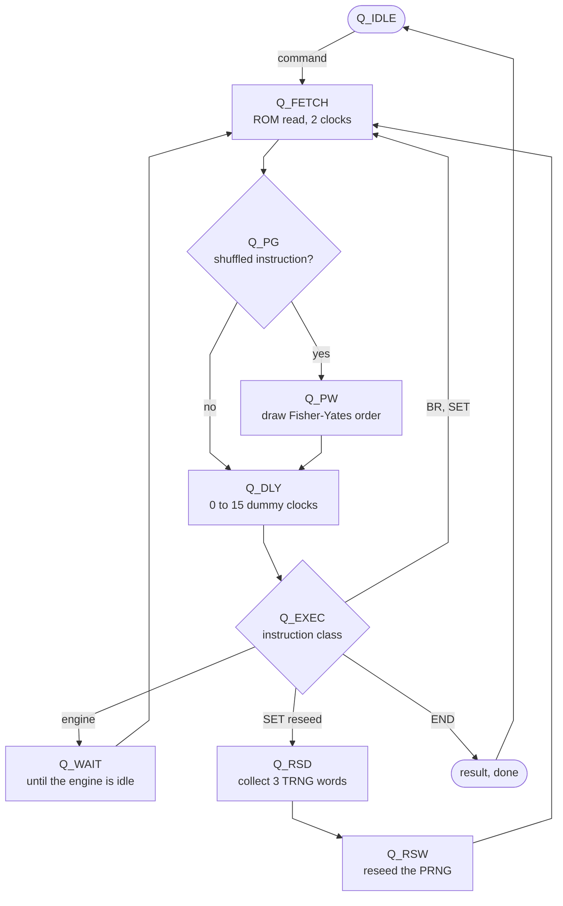

## 6. Lifecycle

The lifecycle moves only forward. Writing the LIFECYCLE register moves it one or more states on; the events on the right move it straight to KILLED.

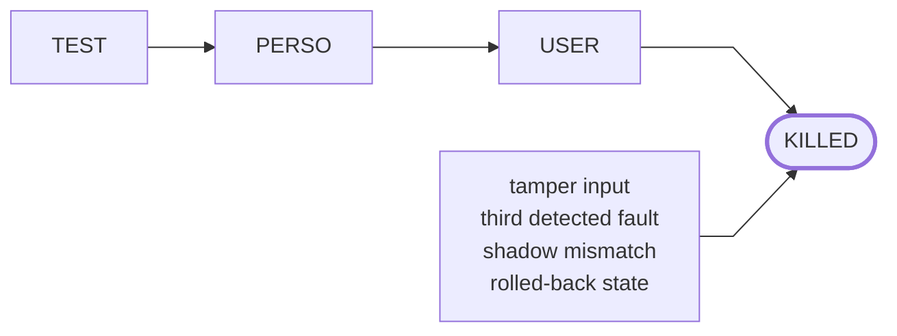

| State | Allowed in addition to the normal commands |
|---|---|
| TEST | injected seeds, raw PUF and TRNG dumps, trigger pin, K readable |
| PERSO | key import, PUF enrollment, K readable |
| USER | none; K stays inside as the masked session key |
| KILLED | nothing |

## 7. Command and fault response

Any detector ends the command with result 8 (FAULT). The host then wipes every key and records the fault before it accepts another command.

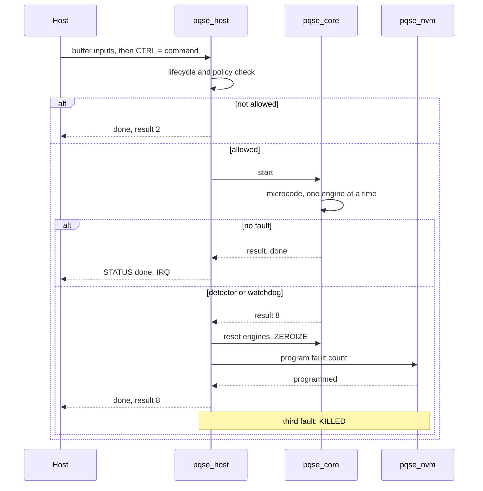

## 8. KeyGen

In microcode order: 16 seeds, 80 G, 720 s and e twice, 790 G check, 106 t-hat and ek, 608 pairwise test (KEYGEN and KGWRAP only), 141 key valid, 144 wrap (KGWRAP only), 156 wipe. Everything is masked until t-hat; t-hat and rho are public.

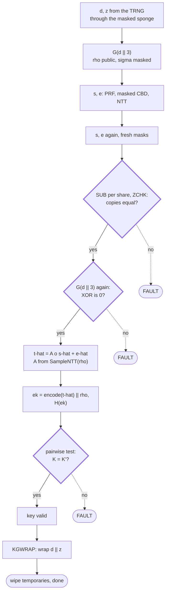

UNWRAP derives the same key pair from the unwrapped d and z; it runs the duplicate checks but skips the pairwise test.

## 9. Decaps

Microcode at 320. m', K', r', the comparison result and K are never unmasked.

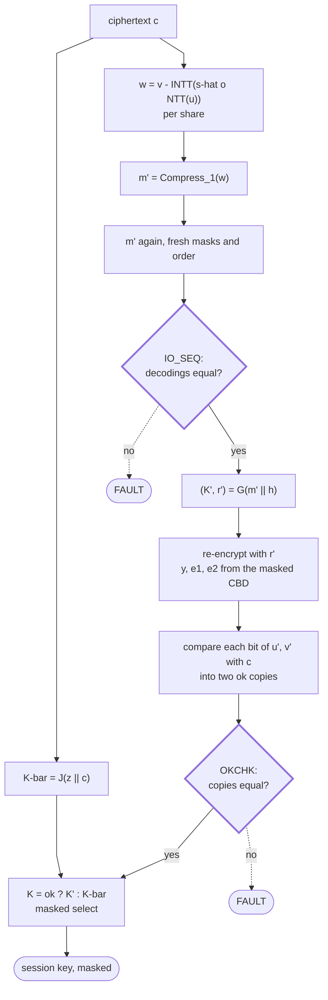

## 10. PUF key and key wrapping

No key is stored. The PUF gives a 180-bit key k through an RM(1,5) fuzzy extractor, and KEK = SHA3-256(k ‖ "K") wraps the seed d ‖ z.

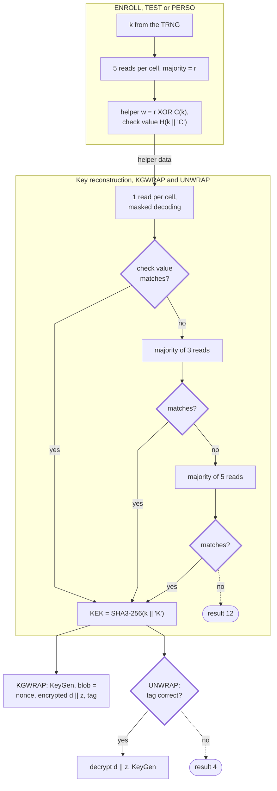

## 11. Secure messaging

The shared secret stays inside both chips as the masked session key SK. Each direction uses its own KMAC customization ("E1", "T1" from initiator to responder), so a message sent back to its sender fails the tag check.

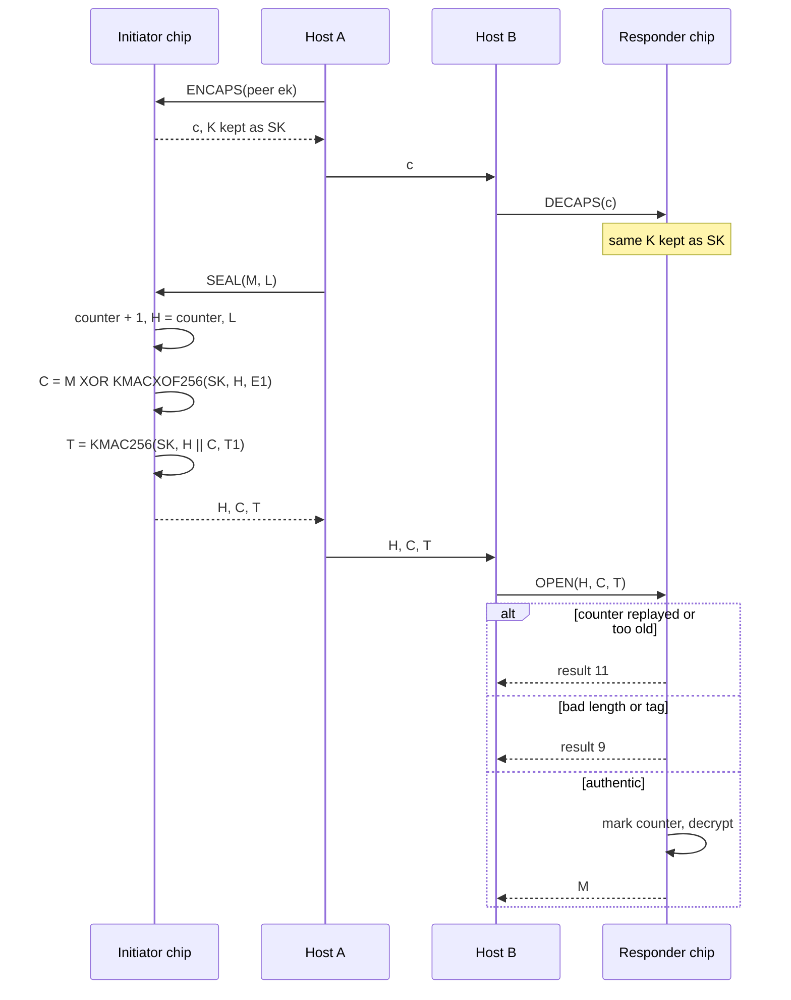

## 12. Verification and energy flow

Top lane: function and security checks. Bottom lane: how the energy figures are produced.

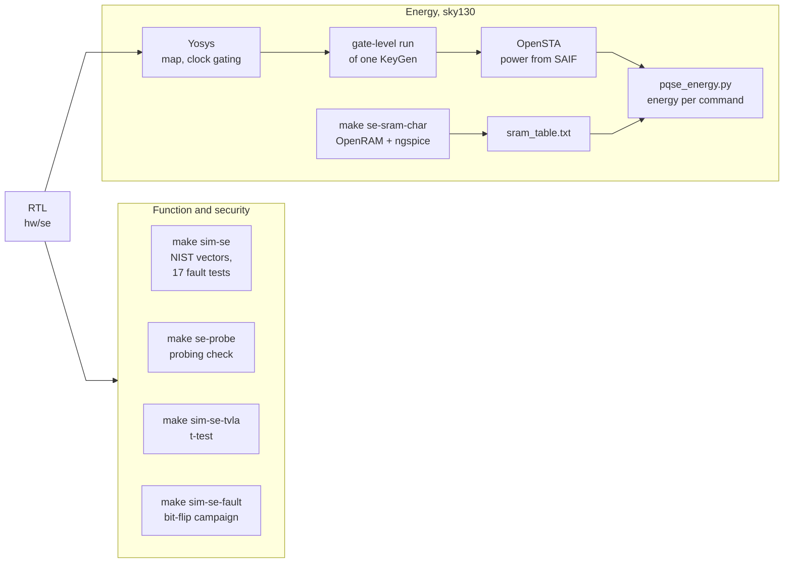
